# Arbit

## 프로젝트 소개

**Arbit**는 사용자의 취향을 기반으로 전시·공연·축제 등 문화 행사를 추천해 주는 백엔드 API 서버입니다.

사용자는 가입 시 선호하는 행사를 5~20개 선택하고, AI 추천 서버(arbit-ai)가 선택한 행사와 유사한 행사를 매칭 점수와 함께 제공합니다. 이후 사용자의 북마크·조회·리뷰 활동이 쌓이면 추천 결과가 갱신되는 구조입니다.

Spring Boot 3 기반의 REST API 서버이며, MySQL을 영구 저장소로, Google Cloud Storage를 프로필 이미지 업로드에 활용합니다. GitHub Actions를 통해 GCP 인스턴스에 자동 배포됩니다.

프론트엔드(https://arbit-umber.vercel.app)와 분리된 구조로, API 서버 도메인은 `piec.store`입니다.

## 문제 정의

문화 행사 정보는 여러 플랫폼에 분산되어 있어 개인 취향에 맞는 행사를 찾기 어렵습니다. 기존 서비스 대부분은 단순 목록 제공이나 장르별 분류에 그칩니다.

Arbit는 사용자가 직접 선택한 선호 행사를 AI로 분석해 개인화된 추천을 제공하고, 키워드·장소·날짜·거리 등 복합 조건으로 원하는 행사를 빠르게 탐색할 수 있도록 합니다. 게스트 로그인을 지원해 회원가입 없이도 탐색 기능을 즉시 사용할 수 있습니다.

## 주요 기능

- **회원 인증**: 회원가입 / 로그인 / 게스트 로그인 / 로그아웃 (JWT Access·Refresh Token)
  - `auth/controller/AuthController.java`, `auth/service/AuthService.java`
- **취향 설정 및 AI 추천 생성**: 사용자가 5~20개 선호 행사를 선택하면 arbit-ai 서버로 추천 요청을 보내 결과를 저장
  - `preference/service/PreferenceService.java`, `preference/service/PreferenceRecommendationService.java`
- **추천 행사 조회**: 사용자별 매칭 점수 순으로 추천 결과 반환, 북마크 여부 포함
  - `recommendation/service/RecommendationService.java`
- **행사 목록 조회 및 필터링**: 카테고리·지역·날짜·상태(진행중/예정)·유무료 조건 복합 필터, 다양한 정렬 기준
  - `event/service/EventService.java`, `event/repository/EventRepository.java`
- **행사 검색**: 키워드로 제목·카테고리·장소·지역·키워드 필드 통합 검색 및 자동완성 제안, 거리순 정렬 지원
  - `event/service/EventSearchService.java`
- **행사 상세 조회**: 행사 정보·키워드·북마크 여부 반환, 조회 로그 기록
  - `event/service/EventService.java#getEventDetail`
- **북마크**: 행사 북마크 추가·삭제, 내 북마크 목록 조회
  - `bookmark/`
- **리뷰**: 행사 리뷰 작성(평점·텍스트·인증 이미지), 리뷰 삭제, 목록 조회. 리뷰 평점은 행사 평균 평점에 반영
  - `review/`
- **마이페이지**: 프로필 조회·닉네임 수정·프로필 이미지 업로드, 내 북마크·리뷰 목록
  - `user/controller/UserMeController.java`
- **홈 화면**: 종료되지 않은 행사를 최신 등록순으로 반환
  - `home/service/HomeService.java`
- **행사 상태 자동 갱신**: 매일 자정(Asia/Seoul) 스케줄러가 행사 상태(진행중·예정·종료) 갱신
  - `event/scheduler/EventStatusScheduler.java`
- **거주지 좌표 변환**: 회원가입 시 입력한 주소를 Kakao Local API로 위도·경도로 변환
  - `auth/service/DefaultResidentialLocationResolver.java`
- **이미지 저장소 이중화**: GCP 프로파일에서는 Google Cloud Storage, 로컬에서는 로컬 디렉터리 사용
  - `storage/GcsStorageService.java`, `storage/LocalStorageService.java`

## 기술 스택

| 구분 | 기술 |
|------|------|
| 언어 | Java 17 |
| 프레임워크 | Spring Boot 3.3.4, Spring Security, Spring Data JPA |
| 데이터베이스 | MySQL 8.0 (운영), H2 (테스트) |
| 인증 | JWT (jjwt 0.12.6) |
| 외부 API | Kakao Local API, arbit-ai (내부 Python AI 서버) |
| 파일 저장 | Google Cloud Storage (운영), 로컬 파일시스템 (개발) |
| API 문서 | springdoc-openapi 2.6.0 (Swagger UI) |
| 빌드 | Gradle 8.10.2 |
| 컨테이너 | Docker, Docker Compose |
| 웹 서버 | Nginx (리버스 프록시, HTTPS) |
| CI/CD | GitHub Actions (테스트·빌드 → GCP SSH 배포) |
| 테스트 | JUnit 5, Mockito, Spring Security Test |

## 아키텍처 및 구조



백엔드(`arbit-app`)는 Spring Boot 기반의 REST API 서버로, Nginx가 HTTPS 요청을 받아 리버스 프록시로 전달합니다. Spring Security와 JWT 필터가 인증을 처리하며, 각 도메인(auth, event, preference, recommendation 등)은 Controller → Service → Repository 계층 구조로 구성되어 있습니다.

AI 추천 서버(`arbit-ai`)는 Python 기반의 별도 컨테이너로, 취향 설정 시 `arbit-app`이 REST 요청을 보내 추천 결과를 받아옵니다. 두 서버는 동일한 MySQL 인스턴스를 공유합니다.


## 핵심 구현 포인트

### 1. JWT 기반 Stateless 인증
`JwtAuthenticationFilter`가 매 요청마다 `Authorization` 헤더의 토큰을 검증하고 `SecurityContextHolder`에 인증 객체를 등록합니다. Access/Refresh Token을 분리하고, 게스트 사용자는 DB에 임시 계정을 생성해 동일한 JWT 인증 흐름을 사용합니다(`AuthService#guestLogin`). 인증이 필요한 엔드포인트와 그렇지 않은 엔드포인트를 `SecurityConfig`에서 명시적으로 구분합니다.

### 2. AI 서버 연동을 통한 개인화 추천
`PreferenceService#createPreferences`에서 사용자가 선택한 선호 행사 ID 목록을 arbit-ai 서버(`/recommendations`)로 전송하고, AI가 반환한 매칭 점수와 추천 이유를 `Recommendation` 엔티티에 저장합니다. AI 응답 오류는 HTTP 상태코드에 따라 4xx(잘못된 입력)와 5xx(내부 오류)로 구분해 사용자에게 적절한 응답을 반환합니다(`PreferenceRecommendationService`).

### 3. 복합 조건 JPQL 검색 쿼리
`EventRepository#findByFiltersOrderByEndDateAsc`와 `searchEvents`는 카테고리·지역·날짜·상태·유무료 등 다수의 선택적 필터를 하나의 JPQL 쿼리에서 boolean 플래그와 null 비교로 처리합니다. 검색 시 제목·카테고리·장소·지역·키워드 필드를 `EventSearchTarget` enum으로 구분해 대상을 지정할 수 있고, 자동완성 제안에서는 매칭 필드를 역추적해 하이라이트 텍스트를 생성합니다(`EventSearchService#highlightText`).

### 4. 다중 정렬 기준 지원
행사 목록/검색 결과를 마감일순·최신순·평점순·거리순으로 정렬할 수 있습니다. 거리순 정렬은 클라이언트가 전달한 위도·경도를 기준으로 각 행사와의 유클리드 거리를 계산하며, 좌표가 없는 행사는 가장 뒤로 밀립니다(`EventSearchService#comparator`).

### 5. 스케줄러를 이용한 행사 상태 자동 관리
`EventStatusScheduler`는 매일 자정 `EventStatusRefreshService`를 호출해 모든 행사의 시작일·종료일을 오늘 날짜와 비교하고 상태(UPCOMING → ONGOING → CLOSED)를 갱신합니다. 상태가 변경된 행사 수만 반환해 불필요한 업데이트를 방지합니다.

## 트러블슈팅 및 기술적 고민

### 취향 입력의 동기/비동기 처리 선택
취향 입력 후 홈 화면으로 전환하는 기능을 구현하는 과정에서, 비동기 처리 시 추천 결과 생성 실패를 사용자가 인지하지 못해 중복으로 취향을 선택하게 되는 문제가 있었습니다. 문제 해결을 위해 취향 입력과 추천 이벤트 저장을 동기 처리로 전환해 취향 저장과 추천 생성 성공 여부를 하나의 트랜잭션 흐름에서 보장하도록 변경하였습니다.


## 폴더 구조

```
src/main/java/com/arbit/app/
├── auth/           # 회원가입·로그인·JWT 필터·보안 설정
├── bookmark/       # 북마크 기능
├── category/       # 카테고리 엔티티·리포지토리
├── common/         # 공통 예외처리·응답 형식·유틸
│   ├── config/     # Security, JPA, CORS, OpenAPI 설정
│   ├── exception/  # BusinessException, GlobalExceptionHandler, ErrorCode
│   └── response/   # ApiResponse, ErrorResponse
├── event/          # 행사 핵심 도메인
│   ├── controller/ # EventController, EventActionController
│   ├── dto/        # 요청·응답 DTO
│   ├── entity/     # Event, EventStatus, EventKeyword 등
│   ├── repository/ # JPQL 복합 필터 쿼리
│   ├── scheduler/  # 자정 상태 갱신 스케줄러
│   ├── security/   # 정렬 파라미터 검증 필터
│   └── service/    # EventService, EventSearchService, EventActionService 등
├── home/           # 홈 화면 API
├── keyword/        # 키워드 엔티티·리포지토리
├── notification/   # 알림 스케줄러 (구현 여부 확인 필요)
├── preference/     # 취향 설정 및 AI 추천 요청
├── recommendation/ # 추천 결과 조회
├── review/         # 리뷰 작성·조회·삭제
├── storage/        # 파일 업로드 (GCS / 로컬)
└── user/           # 마이페이지 프로필·수정
```